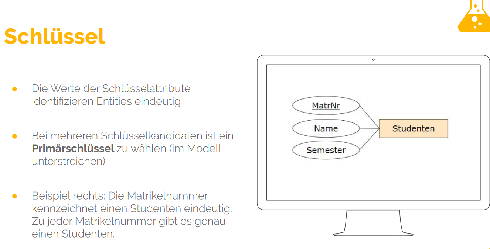
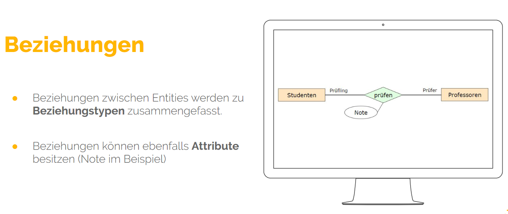

# First day of databases

In the beginning we had 2 short presentations teaching us the basics of databases, for example the 9 signs / requesites for something to actually be a database. 

Codd was the guy who seemed to be pretty important for database knowledge and technology.

### __Data modelling__ seems to be where it's at, we learned about organising excerpts into conceptual schemes that can be formed to logical schemes (which help to further search for and manipulate the data)

 

The 2 forms in which we actively practiced data modelling, were
### __Entity Relation Model__ 
with Values and Data Types

Attributes

Keys

Relations

We practiced it by 2 examples, whereas the first was done unskillfully and vague, the second as well but a lil better.
