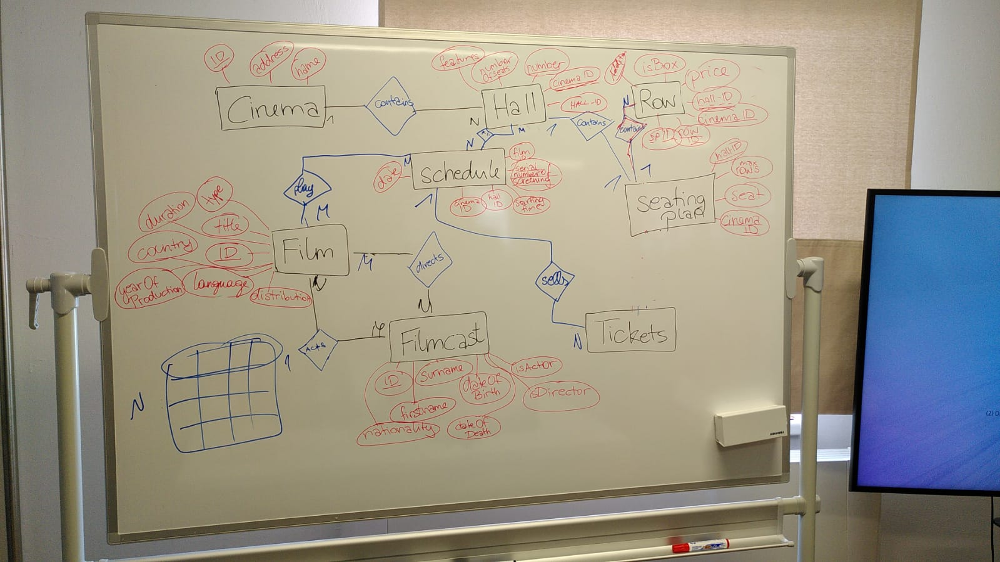

# YASSSS, FINALLY SOME THEORY!

## Anomalies
There are 3 anomalies and 3 forms to norm / standardize databases / relationtypes. 
The 3 anomalies are:
* Insert an.
* Update an.
* Delete an.

They basically just describe the instances in which errors can occur, the normal forms are used to reduce those and redundancies.

## Normal Formation
There are 12 normal forms, whereas 5 are used commonly, and the first 3 are important to us for now.

### 1NF
Structuring the information in the smallest pieces (reasonably) possible.

 

### 2NF
Checks if full funtioncal dependency is given!  
1NF + Non-Key-Attributes are fully dependant on keycandidates.

 

### 3NF
Prevents anomalie and redundancy
2NF + No Non-Key-Attributes are interdependant

I also learned that feeling like drowning in the actual exercise, after havin short but relatively good digestible input, is part of the process.
Having no fkin clue and finding ways to make sense, actually is helpful to developing personal ways to model data. 
That information alone, made the suffering much more bearable.
I still don't like that shit, but I am open to acquiring the taste.

 
oh and we did a group exercise that is way more valuable to be shared then what I did up until now: 
